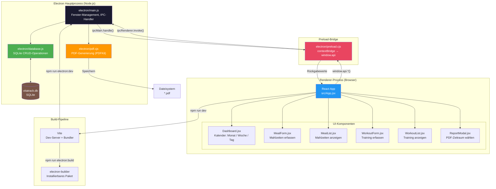
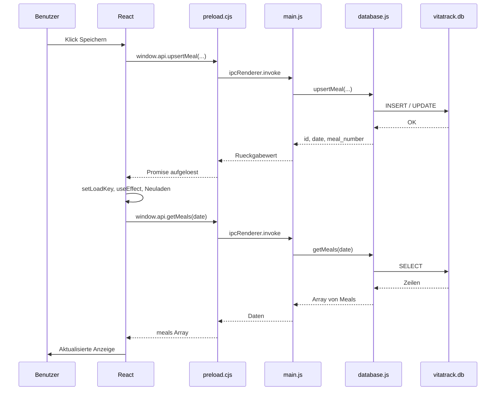
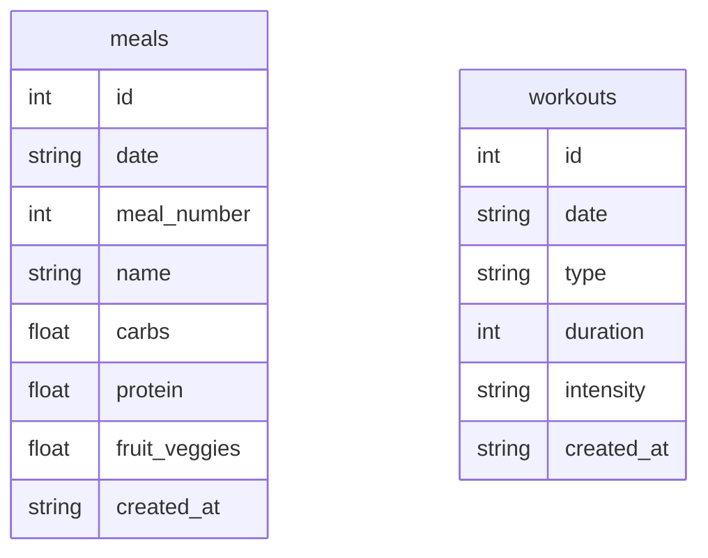

# VitaTrack

Desktop-Anwendung zur Erfassung und Übersicht von Ernährung und Training.

## Technologie-Stack

| Schicht     | Technologie                         |
| ----------- | ----------------------------------- |
| Frontend    | React 18 + Vite                     |
| Desktop     | Electron 33                         |
| Datenbank   | SQLite (better-sqlite3)             |
| PDF-Export  | PDFKit                              |
| Build       | Vite (Frontend), electron-builder   |
| Sprache     | JavaScript (ESM + JSX)              |

## Architektur



### Datenfluss



## Funktionen

### Mahlzeiten
- 3 Mahlzeiten pro Tag (Frühstück, Mittagessen, Abendessen)
- Erfassung des Gerichtsnamens
- Erfassung von Kohlenhydraten, Protein und Obst/Gemüse in Gramm
- Überschreiben bestehender Einträge

### Training
- Trainingsarten: Spazieren, Radfahren, Schwimmen
- Dauer in Minuten
- Intensität: locker, mittel, hoch
- Beliebig viele Einträge pro Tag

### Dashboard
- **Monatsansicht**: Kalender mit farbigen Indikatoren für Tage mit Mahlzeiten/Training
- **Wochenansicht**: 7-Tage-Raster mit Nährstoff- und Trainingsübersicht
- **Tagesansicht**: Detaillierte Zusammenfassung eines einzelnen Tages

### Datenhaltung
- Lokale SQLite-Datenbank (`better-sqlite3`)
- Gespeichert im Electron-Benutzerdatenverzeichnis (`vitatrack.db`)
- WAL-Journal-Mode für bessere Performance

## Projektstruktur

```
vita-track/
├── electron/
│   ├── main.js              # Electron-Hauptprozess, Fenster, IPC
│   ├── preload.cjs          # Context-Bridge (Renderer <-> Main)
│   ├── database.js          # SQLite-Schema, CRUD-Operationen
│   └── pdf.cjs              # PDF-Generierung (PDFKit)
├── src/
│   ├── main.jsx             # React-Einstiegspunkt
│   ├── App.jsx              # Hauptkomponente, Navigation, Zustand
│   ├── App.css              # Globales Styling
│   └── components/
│       ├── Dashboard.jsx    # Kalender-Ansichten (Monat/Woche/Tag)
│       ├── MealForm.jsx     # Mahlzeiten-Formular
│       ├── MealList.jsx     # Mahlzeiten-Liste
│       ├── WorkoutForm.jsx  # Trainings-Formular
│       ├── WorkoutList.jsx  # Trainings-Liste
│       └── ReportModal.jsx  # PDF-Zeitraum-Auswahl
├── index.html
├── vite.config.js
└── package.json
```

## Installation

```bash
# Abhängigkeiten installieren
npm install

# Native Module für Electron neu kompilieren
npm run postinstall
```

## Entwicklung

```bash
# Vite-Dev-Server + Electron parallel starten
npm run electron:dev

# Nur Vite-Dev-Server (Browser-Test)
npm run dev
```

## Produktions-Build

```bash
npm run electron:build
```

Das installierbare Paket liegt anschließend im Ordner `release/`.

## Datenbank-Schema



```sql
-- Mahlzeiten
CREATE TABLE meals (
  id            INTEGER PRIMARY KEY AUTOINCREMENT,
  date          TEXT NOT NULL,         -- YYYY-MM-DD
  meal_number   INTEGER NOT NULL CHECK(meal_number IN (1,2,3)),
  name          TEXT NOT NULL DEFAULT '',
  carbs         REAL NOT NULL DEFAULT 0,
  protein       REAL NOT NULL DEFAULT 0,
  fruit_veggies REAL NOT NULL DEFAULT 0,
  created_at    TEXT DEFAULT (datetime('now'))
);

-- Training
CREATE TABLE workouts (
  id         INTEGER PRIMARY KEY AUTOINCREMENT,
  date       TEXT NOT NULL,            -- YYYY-MM-DD
  type       TEXT NOT NULL CHECK(type IN ('walking','cycling','swimming')),
  duration   INTEGER NOT NULL,
  intensity  TEXT NOT NULL CHECK(intensity IN ('light','medium','high')),
  created_at TEXT DEFAULT (datetime('now'))
);
```

## Systemvoraussetzungen

- Node.js 18+
- npm 9+
- Betriebssystem: macOS, Windows oder Linux
