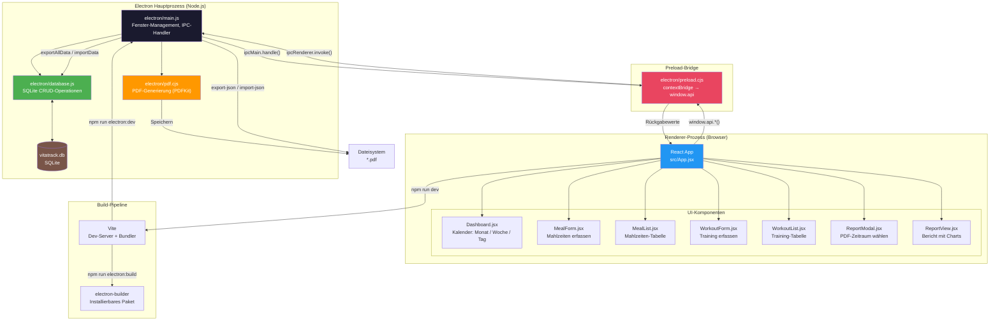
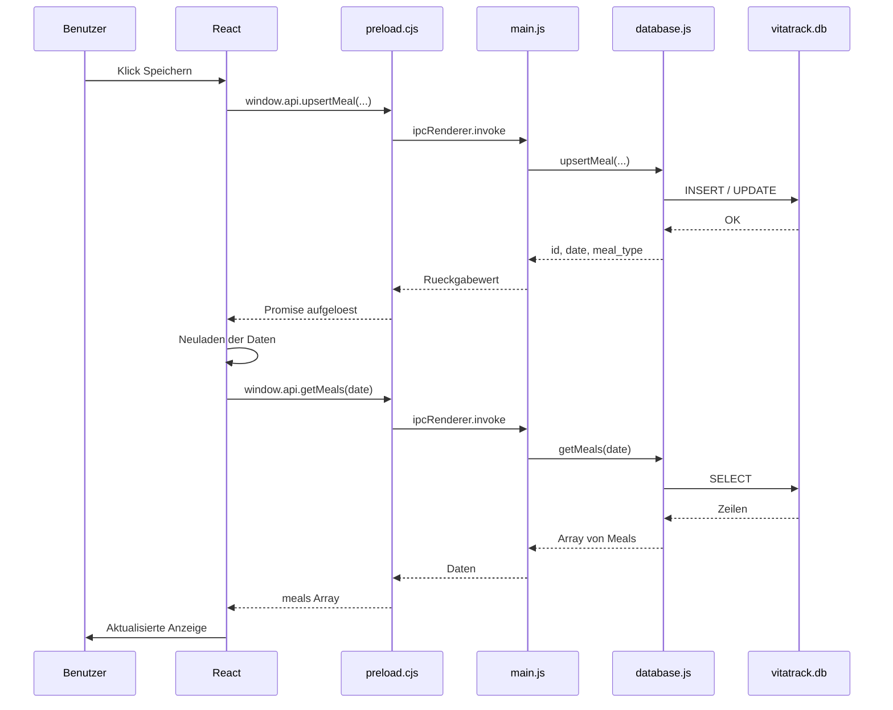
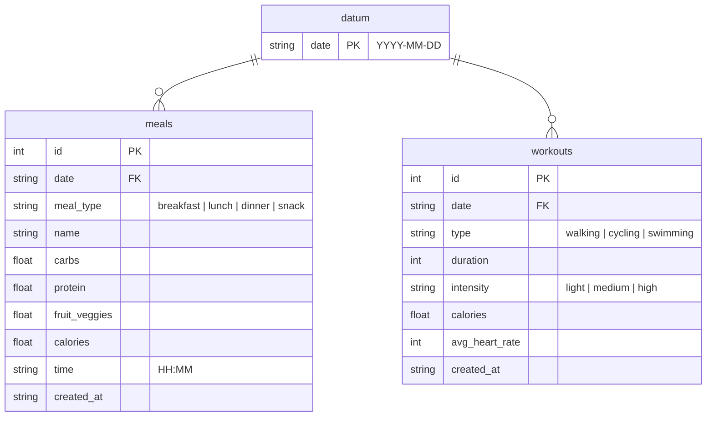

# VitaTrack

Desktop-Anwendung zur Erfassung und Übersicht von Ernährung und Training.

## Technologie-Stack

| Schicht     | Technologie                         |
| ----------- | ----------------------------------- |
| Frontend    | React 18 + Vite                     |
| Desktop     | Electron 33                         |
| Datenbank   | SQLite (better-sqlite3)             |
| PDF-Export  | PDFKit                              |
| Build       | Vite (Frontend), electron-builder   |
| Sprache     | JavaScript (ESM + JSX)              |

## Architektur



### Datenfluss



## Funktionen

### Navigation
- **Dashboard**: Kalender mit Monats-, Wochen- und Tagesansicht
- **Tag erfassen**: Mahlzeiten und Training für ein Datum erfassen/bearbeiten
- **Bericht**: Diagramme und Statistiken für einen frei wählbaren Zeitraum

### Mahlzeiten
- 4 Mahlzeitentypen: 🌅 Frühstück, ☀️ Mittagessen, 🌙 Abendessen, 🍎 Zwischenmahlzeit
- Erfassung des Gerichtsnamens (bis 256 Zeichen)
- Erfassung von Kohlenhydraten, Protein, Obst/Gemüse und Kalorien
- Erfassung der Uhrzeit (default: aktuelle Uhrzeit, frei änderbar)
- Tabelle mit Bearbeiten (✏️) und Löschen (🗑️) Funktionen
- Alternierende Zeilenfarben für bessere Lesbarkeit

### Training
- Trainingsarten: Spazieren, Radfahren, Schwimmen, Workout, Tai Chi, Paddeln
- Dauer in Minuten
- Intensität: locker, mittel, hoch
- Kalorienverbrauch (kcal)
- Durchschnittspuls (bpm)
- Tabelle mit Bearbeiten (✏️) und Löschen (🗑️) Funktionen
- Alternierende Zeilenfarben für bessere Lesbarkeit

### Dashboard
- **Monatsansicht**: Kalender mit farbigen Indikatoren für Tage mit Mahlzeiten/Training
- **Wochenansicht**: 7-Tage-Raster mit Nährstoff- und Trainingsübersicht
- **Tagesansicht**: Detaillierte Zusammenfassung eines einzelnen Tages

### Bericht (In-App)
- Frei wählbarer Datumsbereich (Von/Bis)
- Zusammenfassungskarten (Ernährung & Training Gesamt)
- Balkendiagramme:
  - Makronährstoffe Gesamt (KH, Protein, Obst/Gemüse)
  - Trainingsdauer nach Art
  - Training nach Intensität
  - Makronährstoffe nach Mahlzeit
- Tagesverlauf-Diagramm mit KH, Protein und Training pro Tag

### PDF-Bericht
- Export über "PDF-Bericht" Button
- Deckblatt mit Zeitraum
- Wochen-Zusammenfassung Training (Matrix: Art × Intensität)
- Balkendiagramme (Makronährstoffe, Trainingsdauer)
- Detaillierte Tageseinträge mit Mahlzeiten und Training
- Fußzeile mit Seitennummer und Erstellungsdatum

### JSON-Import / Export
- Export aller Daten als JSON-Datei über den 📤 Export-Button
- Import aus JSON-Datei über den 📥 Import-Button
- JSON-Format mit Version, Export-Datum, Mahlzeiten und Trainings
- **Import-Verhalten**: Mahlzeiten werden per Datum + Mahlzeitentyp upgesert (bestehende überschrieben), Trainings werden immer neu eingefügt
- Validierung des JSON-Formats beim Import
- Ermöglicht Datensicherung und Übertragung zwischen Geräten

### Datenhaltung
- Lokale SQLite-Datenbank (`better-sqlite3`)
- Gespeichert im Electron-Benutzerdatenverzeichnis (`vitatrack.db`)
- WAL-Journal-Mode für bessere Performance
- Automatische Migration von `meal_number` → `meal_type`

## Projektstruktur

```
vita-track/
├── electron/
│   ├── main.js              # Electron-Hauptprozess, Fenster, IPC
│   ├── preload.cjs          # Context-Bridge (Renderer <-> Main)
│   ├── database.js          # SQLite-Schema, CRUD-Operationen, Migration
│   └── pdf.cjs              # PDF-Generierung (PDFKit) mit Charts
├── src/
│   ├── main.jsx             # React-Einstiegspunkt
│   ├── App.jsx              # Hauptkomponente, Navigation, Zustand
│   ├── App.css              # Globales Styling, Tabellen, Charts
│   └── components/
│       ├── Dashboard.jsx    # Kalender-Ansichten (Monat/Woche/Tag)
│       ├── MealForm.jsx     # Mahlzeiten-Formular mit Typ-Dropdown
│       ├── MealList.jsx     # Mahlzeiten-Tabelle mit Bearbeiten/Löschen
│       ├── WorkoutForm.jsx  # Trainings-Formular mit Kalorien/Puls
│       ├── WorkoutList.jsx  # Trainings-Tabelle mit Bearbeiten/Löschen
│       ├── ReportModal.jsx  # PDF-Zeitraum-Auswahl
│       └── ReportView.jsx   # In-App Bericht mit Diagrammen
├── src/assets/
│   └── logo.svg             # Anwendungs-Logo
├── index.html               # HTML-Entry mit Favicon
├── vite.config.js
└── package.json
```

## Installation

```bash
# Abhängigkeiten installieren
npm install

# Native Module für Electron neu kompilieren
npm run postinstall
```

## Entwicklung

```bash
# Vite-Dev-Server + Electron parallel starten
npm run electron:dev

# Nur Vite-Dev-Server (Browser-Test)
npm run dev
```

## Produktions-Build

```bash
npm run electron:build
```

Das installierbare Paket liegt anschließend im Ordner `release/`.

## Datenbank-Schema



```sql
-- Mahlzeiten
CREATE TABLE meals (
  id            INTEGER PRIMARY KEY AUTOINCREMENT,
  date          TEXT NOT NULL,         -- YYYY-MM-DD
  meal_type     TEXT NOT NULL CHECK(meal_type IN ('breakfast','lunch','dinner','snack')),
  name          TEXT NOT NULL DEFAULT '',
  carbs         REAL NOT NULL DEFAULT 0,
  protein       REAL NOT NULL DEFAULT 0,
  fruit_veggies REAL NOT NULL DEFAULT 0,
  calories      REAL NOT NULL DEFAULT 0,
  time          TEXT NOT NULL DEFAULT '', -- HH:MM
  created_at    TEXT DEFAULT (datetime('now'))
);

-- Training
CREATE TABLE workouts (
  id             INTEGER PRIMARY KEY AUTOINCREMENT,
  date           TEXT NOT NULL,            -- YYYY-MM-DD
  type           TEXT NOT NULL CHECK(type IN ('walking','cycling','swimming')),
  duration       INTEGER NOT NULL,
  intensity      TEXT NOT NULL CHECK(intensity IN ('light','medium','high')),
  calories       REAL NOT NULL DEFAULT 0,
  avg_heart_rate INTEGER NOT NULL DEFAULT 0,
  created_at     TEXT DEFAULT (datetime('now'))
);
```

## API-Referenz (window.api)

| Methode | Parameter | Beschreibung |
| ------- | --------- | ------------ |
| `getMeals(date)` | `date: string` | Mahlzeiten eines Tages laden |
| `getMealsRange(start, end)` | `start, end: string` | Mahlzeiten im Zeitraum laden |
| `upsertMeal(date, mealType, name, carbs, protein, fruitVeggies, calories, time?)` | – | Mahlzeit erstellen/aktualisieren |
| `updateMeal(id, mealType, name, carbs, protein, fruitVeggies, calories, time?)` | – | Mahlzeit aktualisieren |
| `deleteMeal(id)` | `id: number` | Mahlzeit löschen |
| `getWorkouts(date)` | `date: string` | Training eines Tages laden |
| `getWorkoutsRange(start, end)` | `start, end: string` | Training im Zeitraum laden |
| `addWorkout(date, type, duration, intensity, calories, avgHeartRate)` | – | Training hinzufügen |
| `updateWorkout(id, type, duration, intensity, calories, avgHeartRate)` | – | Training aktualisieren |
| `deleteWorkout(id)` | `id: number` | Training löschen |
| `getDailySummary(date)` | `date: string` | Tageszusammenfassung laden |
| `getMonthSummary(year, month)` | `year, month: number` | Monatszusammenfassung laden |
| `generatePdfReport(startDate, endDate)` | `start, end: string` | PDF-Bericht generieren |
| `exportJson()` | – | Alle Daten als JSON-Datei exportieren |
| `importJson()` | – | Daten aus JSON-Datei importieren (mit Dateiauswahl) |

## JSON-Format

```json
{
  "version": 1,
  "exported_at": "2026-06-05T12:00:00.000Z",
  "meals": [
    {
      "id": 1,
      "date": "2026-06-01",
      "meal_type": "breakfast",
      "name": "Haferflocken mit Obst",
      "carbs": 45,
      "protein": 12,
      "fruit_veggies": 80,
      "calories": 350,
      "time": "08:30",
      "created_at": "2026-06-01 08:30:00"
    }
  ],
  "workouts": [
    {
      "id": 1,
      "date": "2026-06-01",
      "type": "walking",
      "duration": 30,
      "intensity": "light",
      "calories": 120,
      "avg_heart_rate": 90,
      "created_at": "2026-06-01 18:00:00"
    }
  ]
}
```

## Systemvoraussetzungen

- Node.js 18+
- npm 9+
- Betriebssystem: macOS, Windows oder Linux
